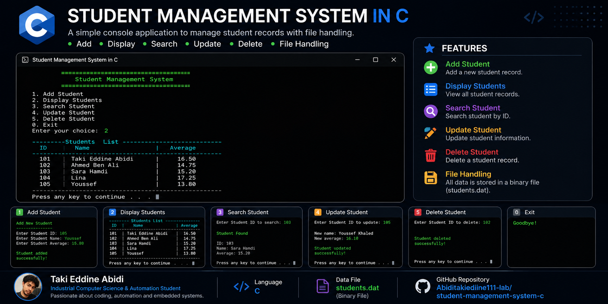

# Student Management System in C

## Description
A simple Student Management System developed in C language.

This project allows users to manage student information with file storage.

## Screenshot

## Features

- Add a student
- Display all students
- Search for a student
- Update student information
- Delete a student
- Save and load data using files

## Technologies

- Programming Language: C
- File Handling

## Project Structure

- main.c : Main source code
- students.dat : Data file

## Author

Abidi Taki Eddine
